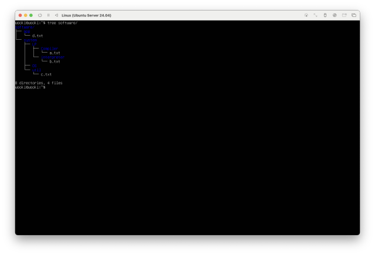

# 3월 14일 수업내용

### 리눅스 디렉토리 개념
- 리눅스 파일 시스템에서 사용하는 기본 디렉토리 개념
- 경로 탐색을 위한 기본적인 심볼
  - `.` : 현재 디렉토리
  - `..` : 부모 디렉토리
  - `/` : 루트 디렉토리
  - `~` : 홈 디렉토리

### 명령어 정리
- `man [명령어]`  
  - 해당 명령어의 매뉴얼을 출력하여 사용법을 확인할 수 있음
- `tree`  
  - 특정 디렉토리(혹은 전체 시스템)의 구조를 트리 형태로 출력
  - `sudo apt install tree`로 설치 후 사용 가능
- `mkdir [디렉토리명]`  
  - 새로운 디렉토리를 생성
- `cat` 명령어를 이용한 텍스트 파일 생성
  - cat > 파일이름.txt
  - 이후 원하는 내용을 입력한 후
  - Ctrl + D를 눌러 저장

  # 실습 과제
  