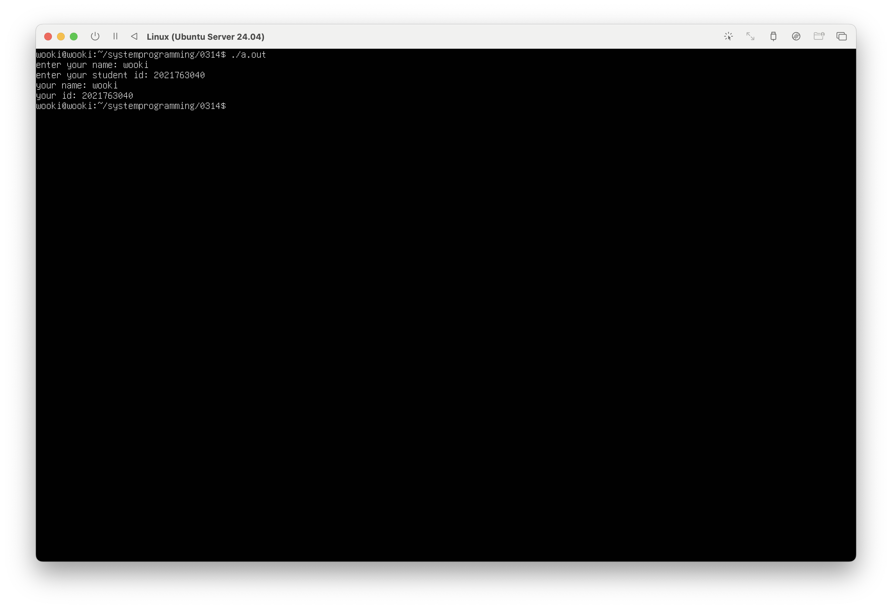

#  3월 21일 수업내용

### 파일 만들기
- touch : 빈 파일 만들기
	- 원래 touch 명령은 타임스탬프를 갱신하는 명령
	- 파일명이 존재하지 않으면 빈 파일을 만드는 것
- cat > {파일명}: 파일 만들기
	- 라인 에디터 (엔터 누르면 위의 줄로 다시 돌아가지 못함)
	- ctrl + D : 저장 후 종료

### 파일 내용 확인하기
- cat : 파일 내용 콘솔에 출력
- more: 파일 내용을 페이지 단위로 콘솔에 출력
- head: 파일의 첫 한 페이지를 출력
- tail: 파일의 마지막 한 페이지를 출력
- wc  : 파일의 라인 수, 단어 수, 글자 수를 차례로 출력

### 지우기
- -r 옵션: 디렉토리도 삭제
- rm 0?? : 0으로 시작하는 3글자 모두 삭제

### C파일 컴파일
- gcc {파일명.c}: c파일을 컴파일
	- 컴파일 되면 a.out (실행파일)이 생성됨
- ./a.out: 실행파일 실행

---

# 실습 과제
