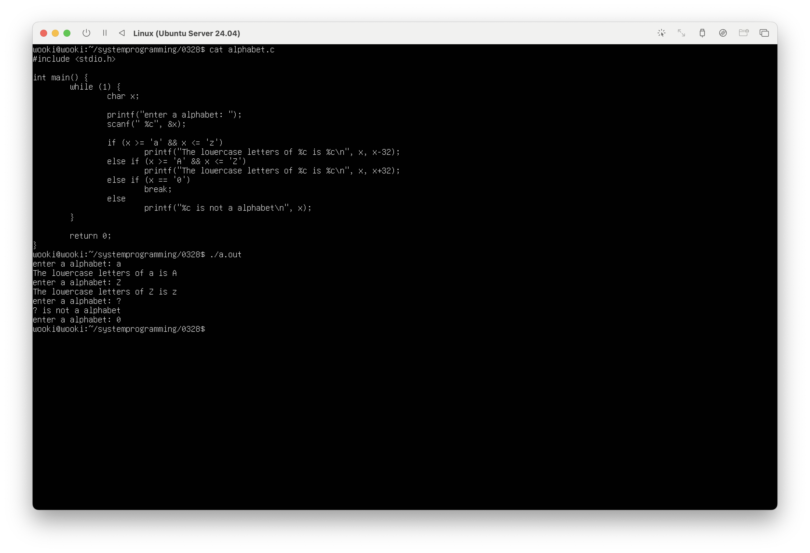

### 변수와 자료형
- 변수: 데이터를 저장하는 메모리 공간
- 자료형
  - 정수형: `int`, `short`, `long`, `char` 및 `unsigned` 시리즈 → 총 8개
  - 실수형: `float`, `double`
  - 논리형: `bool`

### 연산자와 식
- 식(Expression): 상수, 변수, 연산자, 함수의 조합
- `=`: 값 대입 → `var = expression`
  - expression 구성 요소: constant, variable, operator, function
- 연산자 종류:
  - 단항, 산술, 시프트, 관계(비교), 비트, 논리 연산자

### 제어문
- 프로그램 흐름을 제어하는 명령어 구조

### 함수
- 입력값(인자, argument)을 받아 결과값을 반환
- 파라미터: 함수 정의 시 입력 변수
- 인풋과 아웃풋 개념 명확히 구분

### 배열과 컬렉션
- 동일한 데이터타입의 집합
- 인덱스를 통해 요소에 접근
- 배열 이름은 시작 주소를 나타냄

### 포인터
- `&`: 주소 연산자이자 비트 연산자
- 변수의 주소를 참조하거나 조작 가능

### 메모리 구조
- 메모리 영역:
  - 스택: 지역 변수, 함수 호출
  - 힙: 동적 할당
  - 데이터 영역: 전역/정적 변수
  - 텍스트 영역: 코드
- 자바 메모리 구조도 참고 필요

### 구조체
- 서로 다른 자료형을 하나의 단위로 묶은 구조
- 배열과의 차이점: 배열은 동일 자료형

### 파일 시스템 관련 명령어
- `copy [파일명] […]`: 파일 복사
- `mv [파일명] […]`:
  - 다른 디렉토리: 파일 이동
  - 같은 디렉토리: 파일 이름 변경
- `ln [파일1] [파일2]`:
  - 하드링크: 같은 내용을 공유
  - `ln -s`: 심볼릭 링크 (경로 문자열 기반)

### 파일 삭제
- `rm [파일명]`: 파일 삭제

### 파일 속성
- 확인 정보: 블록 수, 파일 종류, 접근 권한, 링크 수, 소유자/그룹, 수정 시간
- 파일 종류 확인: `file [파일명]`

### 접근 권한
- `rwx rwx rwx` 형식 → 사용자/그룹/기타로 구분
- 이진수 변환 후 8진수로 표현 (예: 777)
- `chmod [-R] [권한] [파일]`:
  - 사용자: `u`, `g`, `o`, `a`
  - 연산자: `+`, `-`, `=`
  - 권한: `r`, `w`, `x`

### 소유권 변경
- `chown [파일]`: 소유자 변경
- `chgrp [파일]`: 그룹 변경

### 파일 타임스탬프 변경
- `touch [파일]`: 파일 최종 수정 시간 변경 또는 새 파일 생성

---
# 실습 과제
