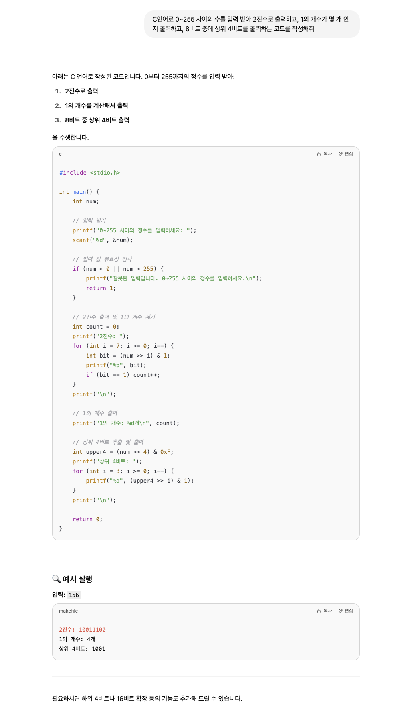

# 4월 4일 수업내용

### 1. 인공지능의 이해
- 인공지능(AI)의 개념과 역사  
- 머신러닝 → 딥러닝 → 생성형 AI로의 진화  
- ChatGPT 사례 중심으로 AI의 급성장 소개  

### 2. LLM의 이해와 기초 활용
- GPT 기반 LLM(Large Language Model)의 구조와 원리  
- 자연어 처리, 문서 생성, 상담 등 폭넓은 활용  
- OpenAI, Google 등 주요 기업들의 기술 동향  

### 3. 챗봇 AI별 특징 알아보기
- ChatGPT Plus 등 챗봇의 차이점 소개  
- 실무에서 활용하는 챗봇 기능 예시  
- 다양한 챗봇 서비스 간의 비교  

### 4. AI와 실무 문서 작성하기
- 프롬프트 설계를 통해 이메일, 제안서, 보고서 작성  
- AI 문서 자동화의 기본 흐름 소개  
- 전문성 있는 실무 문서 작성법  

### 5. 검색의 신세계 AI 검색
- GPT 기반 검색 vs 기존 검색 비교  
- Open/Closed Book Search 개념  
- Perplexity, Bing Chat, ChatGPT의 검색 활용  

### 6. 시각화부터 PPT까지 AI로 뚝딱
- 엑셀 데이터 기반 자동 차트/표 생성  
- 문서-슬라이드 자동 작성 예시  
- Word, PowerPoint, OneDrive 연동 가능  

### 7. AI로 이미지 생성하기
- 텍스트 기반 이미지 생성 도구 소개 (DALL·E, Midjourney 등)  
- 다양한 스타일, 상상 이미지 생성  
- 콘텐츠 제작, 썸네일 활용  

### 8. 무료 영상 생성
- 텍스트/이미지로 영상 제작 (Runway ML 등)  
- 자막, 편집, 배경음악까지 자동화  
- 발표 영상, 유튜브용으로 실용적  

### 9. 오디오 AI 활용
- 텍스트 → 음성 합성 (ElevenLabs, Descript 등)  
- 목소리 편집, 노이즈 제거, 성우 AI 활용  
- 오디오북, 내레이션 영상에 활용 가능  

### 10. 반복되는 업무는 챗봇에게
- 슬랙, 노션 등과 연동되는 자동화 챗봇 구축  
- 이메일 자동 회신, 스케줄 등록 등 업무 자동화  
- Zapier, Make 등의 워크플로우 활용  

---

# 실습 과제
